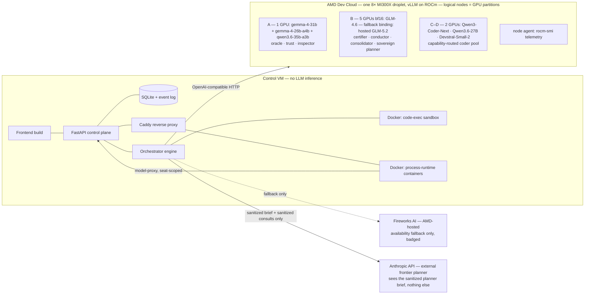

# 01 — System Architecture

Locked 2026-07-07; revised 2026-07-08 (v2.1 — D7 full-local-except-planner, D9 RAW rules). Upstream: design doc v2 §1–3 + v2.1 addendum. Siblings: seats/routing (02), orchestrator (07), API (06).

## 1. Topology overview

Three kinds of hosts:

| Host | Role | Runs | Lifetime |
|---|---|---|---|
| **Control VM** ("platform host") | Always-on address of the product | FastAPI control plane, orchestrator, SQLite, built frontend, Caddy, process-runtime containers, code-exec sandbox containers, local Whisper (policy dictation, O9) | 24/7 — **DigitalOcean s-2vcpu-4gb** (decided 2026-07-09: same account/billing/`doctl` as the MI300X fleet, same region for control↔fleet latency; Hetzner CX32 / Fly.io = fallback) |
| **MI300X droplets** ("the fleet") | **All model inference by design** (D7): trust, certifier, conductor, consolidator, sovereign planner, coder fleet, oracle, inspectors, every operate-phase run. Droplet shapes are 1× and 8× only (11 §0): demo profiles run **one 8× droplet partitioned into logical nodes A/B/C/D** (02 §5); validation/idle runs a 1× droplet | vLLM (ROCm) instances per packing profile, node agent (telemetry + health) | Elastic: booted for builds, demos, validation, judging window |
| **Fireworks AI** (AMD-hosted serving) | **Availability fallback only** (D7): keeps the URL alive between fleet sessions (node-B fallback = frontier-class GLM-5.2); failover if a node dies. Never a designed-in seat home; usage badged in the UI | — | Always available |
| **Customer connections** (BYOK, D13) | Optional customer-added OpenAI-compatible endpoints with per-model capability flags; SANITIZED ceiling by default, RAW/sovereign only via boundary attestation (02 §8) | — | Customer-managed |



## 2. Hosting justification (lift into README + deck — judge-facing)

> **Every token this platform generates is generated on AMD silicon — and everything except one planning conversation happens on GPUs the customer controls.** Self-hosted MI300X droplets (vLLM on ROCm) run the trust layer, plan completion and certification, the wave conductor, the parallel build/processing fleet, consolidation, QA inspectors, the Numeric Oracle, and every operate-phase run. The single designed-in external call is the stage-1 frontier planner — and it only ever sees a sanitized brief, governed by the customer's own confidentiality policy. **Sovereign Mode moves even that on-fleet: zero non-local calls.** Fireworks AI (also AMD serving) is our resilience layer — it keeps the demo URL alive when the elastic fleet is powered down, clearly badged whenever it serves. The one non-GPU machine in the system is a small coordination VM that hosts the UI, the SQLite ledger, and the scheduler. **It runs zero LLM inference — it is the receptionist, not the brain.**
>
> This split is not a hackathon convenience; it *is* the product architecture. In production the thin control plane sits inside the customer's walls — or on dedicated AMD capacity we operate for them — and schedules work onto their GPUs, elastic allocation justified line-by-line by each plan's model bill-of-materials. For the hackathon it also means the ~$100 GPU credit is spent where compute matters — live builds, live demos, the judging window — instead of idling to keep a URL alive.

Evidence checklist for the AMD gate (repo + deck + live URL, pre-screen ignores the video):
- README: the paragraph above + the §1 diagram + "where each stage runs" table (03 §1).
- Code: `backend/app/models/` (router, vLLM + Fireworks clients), `infra/droplet/` (ROCm bootstrap), fleet manager (07 §5).
- Live URL: GPU telemetry panel (rocm-smi data), per-seat backend badges, egress ledger.
- Deck: one slide = the diagram + the paragraph.

## 3. Data boundary & zones

Data classes and where they may travel (enforced by the ModelRouter, 02 §4 — not by convention):

| Data class | LOCAL (MI300X) | AMD_HOSTED (Fireworks, fallback only) | CUSTOM (BYOK endpoints, D13) | EXTERNAL (Anthropic) |
|---|---|---|---|---|
| `RAW` (customer data; post-stage-2 artifacts incl. the certified plan, D9) | ✅ | ⚠️ demo-exception only (`ALLOW_RAW_ON_AMD_HOSTED=true`, all demo data is synthetic; UI badges the run "fallback serving") | ❌ unless the connection is boundary-attested (then ⚠️ "customer-attested" badge; `counts_as_local` additionally satisfies Sovereign Mode — 02 §8) | ❌ hard error |
| `SANITIZED` (planner brief, Plan v1, consult payloads) | ✅ | ✅ | ✅ | ✅ normal / ❌ in Sovereign Mode |

- The boundary rule, one sentence: **`RAW` never leaves `LOCAL`; `EXTERNAL` only ever receives the sanitized planner brief and sanitized consults.**
- Stage 0 masks the inputs and composes the brief; stage 2 deliberately **re-introduces** production detail into the plan (rehydration, D9) — legal because every downstream seat is `LOCAL` (D7). Whatever goes *back out* to the planner passes the consult sanitization gate (03 §4.2).
- **Sovereign Mode** (global toggle + per-job flag): the `planner` seat rebinds from `anthropic:*` to `local:B/*` (D7) — the entire pipeline runs on the self-hosted fleet, zero non-local calls; any `EXTERNAL`-zone egress during a sovereign job raises `SovereignViolation` and paints the run red. The network-monitor demo reads the egress ledger (below), it is not cosmetic.
- **Egress ledger:** all outbound HTTP from the control plane goes through one wrapped client (`boundary/egress.py`). Every request logs `(ts, host, zone, seat, scope, bytes)` to `egress_log` and streams to the UI. This powers the Sovereign finale, the per-job "exactly N external calls, all sanitized" receipt, and the "zero frontier calls per run" operate-phase claim.

## 4. Repository layout (monorepo)

```
backend/
  app/
    main.py                 # FastAPI app factory, lifespan (engine start, node poll)
    config.py               # pydantic-settings; every env var used anywhere
    db/                     # schema.sql, engine, dao modules (05)
    events.py               # Event envelope + typed catalog (06 §3)
    orchestrator/           # engine, stage registry, worker pool (07)
    boundary/               # stage 0: intake dialogue, policy distillation (D11), context intake
                            #   (code map, DB schema extract), PII masking, OCR, voice transcription
                            #   (whisper.cpp wrapper), consult sanitization gate (03 §4.2), egress client
    planning/               # stage 1: planner prompts (execution-fabric contract, 03 §3), constrained re-plan
    certify/                # stage 2: checklists incl. production-fit, triage, amendments,
                            #   rehydration (D9), goal emission (D10), test-spec emit
    quote/                  # stage 3 (10 §4)
    fleet/                  # stage 4 workers + node registry/scheduler (07 §5)
    conduct/                # stage 4 wave review: conductor prompts, scope-locked amendment validation (D8)
    consolidate/            # stage 5
    qa/                     # stage 6: inspectors, oracle, tickets (08)
    runtime/                # operate phase: topology runner, process-runtime mgmt (04)
    refine/                 # refine triage + versioning (04 §5)
    sandbox/                # judge sandbox: companies, guards, queue (09)
    metering/               # meter hooks, rates, invoice (10)
    api/                    # routers: jobs, processes, runs, fleet, egress, sandbox, admin
  tests/
frontend/                   # React (Vite). Visual design = separate session; consumes 06 only
infra/
  vm/                       # docker-compose.yml, Caddyfile, deploy notes
  droplet/                  # bootstrap.sh (ROCm/vLLM), node-agent/, packing profiles (02 §5)
  seeds/                    # seed-kit + sandbox-company generators (09)
docs/                       # hackathon docs, plans, these specs
```

## 5. Control-plane processes on the VM

| Process | What | Notes |
|---|---|---|
| `uvicorn app.main:app` | API + SSE + orchestrator (single process) | The engine runs as asyncio tasks inside the API process — one writer to SQLite, no IPC |
| Caddy | TLS, `/` → frontend static, `/api` → uvicorn, `/processes/{slug}` → process-runtime containers | auto-HTTPS on the demo domain |
| Docker | (a) code-exec sandbox: `python:3.12-slim` + pytest, `--network none`, per-task workspace mounts; (b) process-runtime containers: one shared image, per-process package mount, network = VM-internal only (model-proxy) | images built `linux/amd64` |

Generated code **never** runs inside the API process. Build-time tests run in (a); operate-phase runs execute in (b) under the runtime contract (04 §3). Process containers reach models only through `POST /api/proxy/complete` with a per-process token scoped to the seats in its BoM — a real security story, one afternoon of work.

## 6. Configuration & secrets

Single `.env` on the VM (pydantic-settings; every var has a default that boots in dev):

```
APP_BASE_URL=            # public https URL
ANTHROPIC_API_KEY=       # planner (default mode)
FIREWORKS_API_KEY=
FIREWORKS_BASE_URL=https://api.fireworks.ai/inference   # override for testing/self-host
HF_TOKEN=                # gated model downloads on the droplet (Gemma repos)
DIGITALOCEAN_ACCESS_TOKEN=   # fleet automation via doctl --api-url https://api-amd.digitalocean.com (O5)
SQLITE_PATH=/data/platform.db
SEATS_CONFIG=infra/seats.yaml        # seat → bindings (02 §3)
FLEET_CONFIG=infra/fleet.yaml        # node inventory (07 §5)
SOVEREIGN_DEFAULT=false
ALLOW_RAW_ON_AMD_HOSTED=true         # demo exception; badge in UI. Set false to show enforcement
WHISPER_MODEL_PATH=                  # whisper.cpp model for policy dictation (O9); empty = voice input disabled
FIREWORKS_DAILY_BUDGET_USD=15
SANDBOX_RUN_BUDGET_USD=0.50
SANDBOX_MAX_CONCURRENT=1
ADMIN_TOKEN=                         # admin endpoints + node registration
DISCORD_WEBHOOK_URL=                 # idle-fleet + budget alerts (optional)
```

## 7. Non-functional requirements

- **Streaming-first:** any operation >2 s must emit progress events (06). SSE heartbeat every 10 s. No request may *appear* hung (rules doc 30 s norm).
- **Resumability:** a control-plane restart mid-job resumes at stage granularity (07 §4). Demos survive a crash.
- **Determinism where promised:** seed kits use fixed RNG seeds; temperature per seat is configured (02 §3); rehearsed beats are *re-runnable*, never canned — outputs are always computed live (track rule).
- **Replay:** the event log makes every completed job/run re-watchable (09 §6) — the always-working demo surface if live GPU capacity is down.
- **English-only** output everywhere (track rule) — system prompts state it.
- **MIT license** at repo root; no GPL-incompatible deps.
